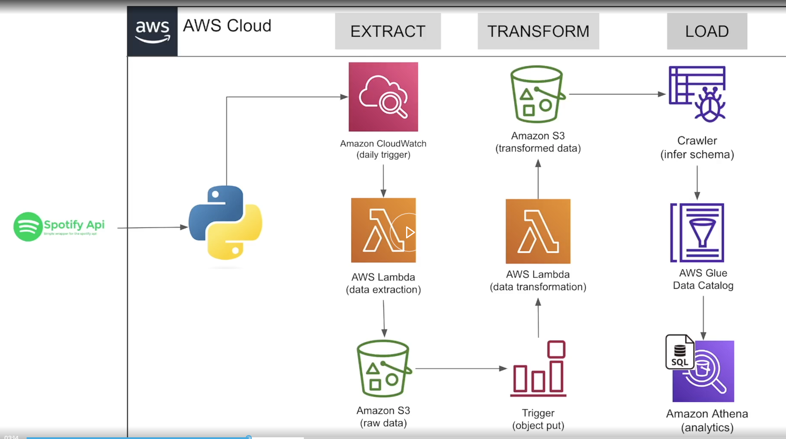

# Spotify-End-to-End-Data-Engineering-Project 
## [AWS Stack]

Serverless ETL pipeline on AWS using Python.  Extracts data from Spotify API (Lambda + CloudWatch) Stores raw data in S3 Transforms data with Lambda (triggered by S3 events) Uses Glue + Athena for schema and querying  Tech stack: Python, AWS Lambda, S3, Glue, Athena, CloudWatch

## 📊 Project Overview

This project is an end-to-end **ETL data pipeline on AWS**, built with Python and fully serverless.

The pipeline extracts data from the Spotify API, stores it in Amazon S3, transforms it into a cleaner analytics-ready format, and makes it queryable with SQL using AWS Glue and Amazon Athena.

## 🏗️ ETL Pipeline Architecture

## 🔹 Step 1 — Extract data from Spotify API

- A Python script runs inside **AWS Lambda**
- The function connects to the **Spotify API**
- It sends requests to collect the required data
- API responses are returned in **JSON** format
- The extracted raw data is saved into an **Amazon S3 raw bucket**

### What happens in this step
- Scheduled ingestion using **Amazon CloudWatch**
- External API integration with Python

---

## 🔹 Step 2 — Trigger the transformation process

- When a new file is uploaded to the raw S3 bucket, an **S3 ObjectCreated event** is triggered
- This event automatically invokes a second **AWS Lambda** function
- This makes the pipeline event-driven and fully automated

### What happens in this step
- No manual execution needed
- Every new raw file can start the next stage automatically
- Helps keep the pipeline modular and scalable

---

## 🔹 Step 3 — Transform the raw data

- The second Lambda reads the raw file from S3
- The data is processed using Python
- Main transformation tasks include:
  - cleaning missing or invalid values
  - standardizing field names and formats
  - flattening nested JSON structures
  - normalizing the schema
  - preparing the dataset for analytics

- After processing, the transformed data is stored in a separate **Amazon S3 transformed bucket**

### What happens in this step
- Raw API data becomes structured and easier to query
- The transformed bucket acts as the processed layer of the data lake
- The pipeline separates raw and cleaned data for better organization

---

## 🔹 Step 4 — Crawl the transformed data

- After transformed data is written to S3, an **AWS Glue Crawler** scans the transformed bucket
- The crawler inspects the files and **infers the schema automatically**
- It identifies:
  - column names
  - data types
  - table structure

- The crawler then updates the **AWS Glue Data Catalog**

### What happens in this step
- No need to define the schema manually
- Metadata is generated automatically
- The dataset becomes discoverable and ready for querying

---

## 🔹 Step 5 — Register metadata in Glue Data Catalog

- The schema detected by the crawler is stored in the **AWS Glue Data Catalog**
- The catalog works like a metadata layer for the pipeline
- It keeps track of the table definition and structure of the transformed dataset

### What happens in this step
- The processed data is organized as a queryable table
- Other AWS analytics services can use the catalog
- It creates the connection between S3 data and SQL querying

---

## 🔹 Step 6 — Query the data with Athena

- **Amazon Athena** reads the table metadata from the Glue Data Catalog
- It allows SQL queries to run directly on top of the transformed data stored in S3
- No separate database needs to be provisioned

### What happens in this step
- Data can be analyzed with standard SQL
- Query results can be used for reporting or further analysis
- The full pipeline supports analytics in a fully serverless way

---

## ⚙️ Technical Features

- **Fully serverless architecture**
- **Daily scheduled extraction with CloudWatch**
- **Event-driven processing with S3 triggers**
- **Automated schema detection with AWS Glue Crawler**
- **Metadata management with Glue Data Catalog**
- **SQL querying on S3 using Athena**
- **Separation between raw and transformed data layers**
- **Scalable and cost-efficient design**

---

## 🚀 Key Functionalities

- Automated data ingestion from Spotify API
- Raw data storage in Amazon S3
- Automatic transformation when new files arrive
- Schema inference through AWS Glue Crawler
- Centralized metadata cataloging
- Serverless analytics with Amazon Athena
